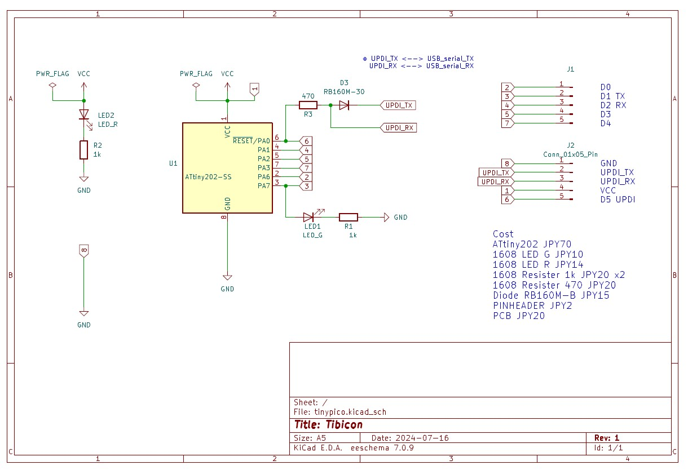
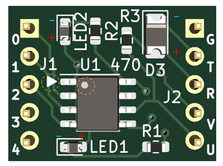
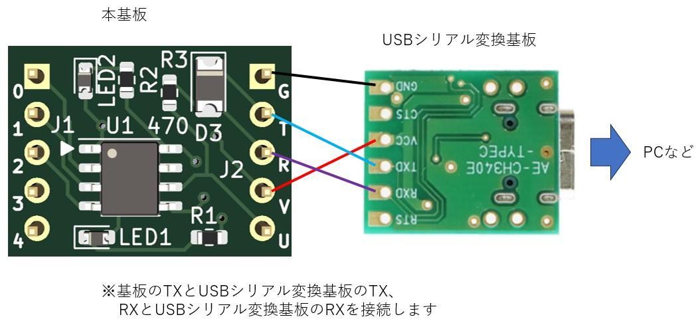

# TinyPico

## 概要 (Overview)

ATtiny202 を使ったマイコンボードで、コンセプトとしては小サイズ・低コストで、サイズは 19.0mm x 14.0mm となっています（バリを除く）。2024 年現在、市販されている Arduino 互換機の中で最小です（作者調べ）。

PCB 基板のほかに必要な部品コストは 170 円ほどです（秋月電子価格、送料を除く）。
[](https://youtu.be/s8ysajxk5xc)

### ピンアサイン


※書き込み用の UPDI_TX、UPDI_RX と Serial 通信用の TX(GPIO0)、RX(GPIO1)があります。

## 動作要件 (Requirements)

Arduino IDE
<br>　 Arduino IDE 1 系/2 系で動作確認済み
<br>ただし、ライブラリによっては動作しないものもあります。<br>
RAM が小さいので大規模なプログラムには向きません。

書き込みや Serial Print を使用するには USB シリアル変換モジュールが必要です。

## 部品リスト（Parts list）

| 部品                         | 種類           | 秋月コード           | 数量 |
| ---------------------------- | -------------- | -------------------- | ---- |
| 本 PCB                       | -              | -                    | 1    |
| AVR マイコン ATtiny202       | ATTINY202-SSNR | 115731               | 1    |
| ショットキーバリアダイオード | RB160M-30TR    | 101398               | 1    |
| 1608 抵抗                    | 1kΩ            | 111790               | 2    |
| 1608 抵抗                    | 470Ω           | 106471               | 1    |
| 1608LED                      | Green          | 111878               | 1    |
| 1608LED                      | Red            | 111879               | 1    |
| ピンヘッダ                   | オスまたはメス | 105779 または 100167 | 5x2  |

※ただし、抵抗は Amazon などでセットになったものを入手するほうが安いです

## 回路図（Schematics）

[](schematics/tinypico.pdf)

## 組み立て方 (Build guide)

LED とショットキーバリアダイオードは極性があります。
<br>抵抗は極性はありません。
<br>マイコン(ATtiny202)は 1 番ピンの向きに注意してください。


ピンヘッダは好みに応じて、メスピン・オスピン、上向き・下向きが選択可能です。
<br>ピンヘッダをはんだ付けするときは基板に対して垂直になるように気をつけてください。ピン 1 本だけ仮ではんだ付けをして正しく接触していることを確認するとよいです。

## 書き込み方法 (Writing method)

ATtiny202 を使用した本マイコンボードは、シリアル UPDI または jtag2updi で書き込みが可能ですが、本プロジェクトではシリアル UPDI を前提として設計しており、こちらを推奨します。
<br>※jtag2updi でも使用可能ですが、外付けの抵抗が必要です。
<br>　以下はシリアル UPDI での書き込み方法です。

### 書き込み時の接続

| 本マイコンボード | シリアル USB |
| ---------------- | ------------ |
| UPDI_TX          | TX ※         |
| UPDI_RX          | RX ※         |
| VCC              | VCC          |
| GND              | GND          |



### 書き込み手順

1.　 Arduino IDE のメニュー「ファイル ¥ 環境設定」より追加のボードマネージャに URL に「http://drazzy.com/package_drazzy.com_index.json」 を追加します。

2.　「ツール ¥ ボードマネージャ」より、「megaTinyCore」を追加します。


3.　「ツール」より、ボード情報を

- ボード:ATtiny412/402/212/202
- Chip:ATtiny202
- 書き込み装置:SerialUPDI - SLOW:57600 baud
  <br>のように変更します。


4.　メニューの「スケッチ ¥ 書き込み装置を使って書き込む」でスケッチを書き込みます。


Arduino IDE の 1 系ではいつもと同じようにスケッチを書き込みボタンを押下でも書き込むことが可能です。


## 使い方 (How to cording)

### L チカ

基本は Arduino と同様に使用できます。
<br>Builtin_LED（基板上の赤 LED）はピン番号 1 で使用できます。
<br>※緑 LED は電源ランプで、通電時に点灯します。

```
void setup() {
  pinMode(1, OUTPUT);
}

void loop() {
  digitalWrite(1, LOW);
  delay(1000);
  digitalWrite(1, HIGH);
  delay(1000);
}
```

ピン番号（GPIO）は 0 ～ 4 が使用可能です。

### PWM

本基板では GPIO0 と GPIO3 で PWM が使用できます。
<br>GPIO3 では通常の Arduino と同じ使い方で使用できますが、GPIO0 では以下のようにコーディングします。

```
void setup() {
  //GPIO0のセットアップ
  pinMode(0, OUTPUT);
  TCB0.CTRLA = TCB_ENABLE_bm | TCB_CLKSEL_CLKDIV1_gc; //start the timer, set the prescaler to 1
  TCB0.CTRLB = TCB_CCMPEN_bm | TCB_CNTMODE_PWM8_gc; //enable WO0, select the 8 bits PWM mode
  TCB0.CCMPL = 255; //set the PWM resolution to 8 bits
  TCB0.CCMPH = 0; //set the duty cycle
  //GPIO3のセットアップ
  pinMode(3, OUTPUT);
}

void loop()
{
  for (int i = 0; i < 256; i++)
  {
    //GPIO0のPWM
    TCB0.CCMPH = i;
    //GPIO3のPWM
    analogWrite(3,i);
    delay(10);
  }
}
```

### Serial print の使い方

USB シリアル変換は内蔵していませんので、外部の USB シリアル変換を使います。

#### USB シリアル使用時の接続

| 本マイコンボード | シリアル USB |
| ---------------- | ------------ |
| TX(GPIO0)        | RX           |
| RX(GPIO1)        | TX           |


※図は基板電源をUSBシリアルから給電する場合

Teraterm などで読み取ることができます。Arduino IDE でも読み取ることはできますが、書き込み時と接続が異なりますので USB シリアルの繋ぎ変えが必要になります。
<br>※D1 ピン（Builtin LED）と D2 ピンを共有しているため Serial と同時に使うことはできません。

## サンプルコード（Sample Code）

[sample フォルダ](/sample/)を参照ください。

## ブートローダーの書き込み (How to write bootloader)

マイコンがおかしくなった時やブートローダーが書き込まれていないマイコンを購入した場合は書き込みが必要になります。Arduino IDE で書き込むことが出来ます。
<br>通常は必要ありません。


## ライセンス (License)

This software is released under the MIT License, see LICENSE.
